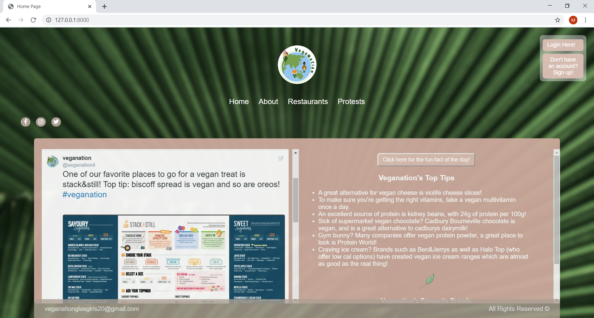

# veganation_project
Welcome to VegaNation, the latest platform for vegan people to try out top-rated restaurants around Glasgow!
This application is for people who would like to visit new vegan places, but do not happen to have vegan friends (yet). 
VegaNation aims to create a supporting community amongst vegan people who dine together and might go to eco-conscious protests together by 
finding users new buddies!

This project has been created as part of the University of Glasgow course on Web Application Development by Orla Sonvico, Kamilla Kurta, 
Marzia Deodato and Sonali Bhaskar.

You can run the website on PythonAnywhere at the following link @..............
or follow the steps below to run it locally.

### Run veganation_project locally
Clone veganation_project repository and go through your command line to veganation_project source folder. Make sure to do the following:

>
    pip install -r requirements.txt

    python manage.py makemigrations veganation

    python manage.py migrate

You will have to delete db.sqlite3 before running the population script to avoid duplicates.

>
    python population_script.py
 
And now you are good to run the server

    python manage.py runserver
    
 And after navigating to http://127.0.0.1:8000/ you will be welcomed to our page!
 
 
 
 ### External Sources
 
 Django 2.2.3 - https://www.djangoproject.com/ 
 
 bcrypt 3.1.7 - https://pypi.org/project/bcrypt/
 
 django-allauth 0.41.0 - https://pypi.org/project/django-allauth/
 
 django-bootstrap4  0.0.8 - https://django-bootstrap4.readthedocs.io/en/latest/history.html#id1
 
 django_star_ratings 0.9.1 - https://pypi.org/project/django-star-ratings/
 
 django_google_maps 0.12.1 - https://pypi.org/project/django-google-maps/ with API (JavaScript) https://developers.google.com/maps/documentation/javascript/tutorial
 
 django_crispy_forms  1.9.0 - https://pypi.org/project/django-crispy-forms/
 
 django-pandas 0.6.1 - https://pypi.org/project/django-pandas/
 
 django-reset-migrations  0.4.0 -  https://pypi.org/project/django-reset-migrations/
 
 JQuery 3.1.0 - https://pypi.org/project/django-jquery/
 
 Pillow 7.1.1 - https://pypi.org/project/Pillow/
 
 requests  2.23.0 - https://pypi.org/project/requests/
 
 Twitter Feed API - https://developer.twitter.com/en/docs/api-reference-index
